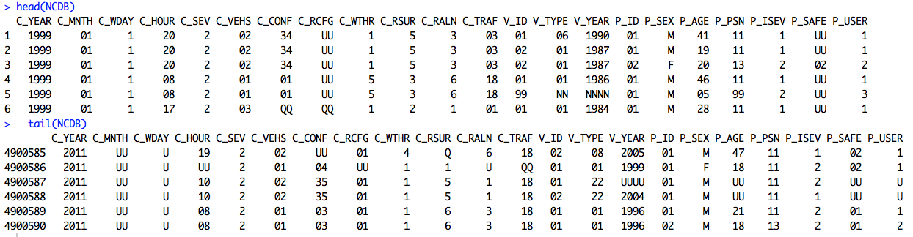

#Transport Accident Analysis
#####**Exploring Insights from National Collision Database (NCDB) Open Data from Transport Canada**
===========

### Introduction
The Government of Canada's [**Open Data Portal**](http://open.canada.ca/en) has provided an [open dataset](http://open.canada.ca/data/en/dataset/1eb9eba7-71d1-4b30-9fb1-30cbdab7e63a) containing 13-year records of all police-reported motor vehicle collisions on public roads in Canada from 1999 to 2011. The data are provided by the provinces and territories to federal government and combined as national-level collision database. 

This project conducts statistical data analysis of the collision datasets using R application and aims to find conclusion to the folloiwng defined hypotheses:

1. [Which types of vehicular collisions have high trend of fatalities and injuries from 1999 to 2011?](doc/H01/Hypothesis_01.md)
2. [Which passenger seat position in the Light Duty Vehicles is the safest/most dangerous?](doc/H02/Hypothesis_02.md)
3. [Do drivers with different genders have different accident pattern?](doc/H03/Hypothesis_03.md)
4. [Is there a certain age range of drivers that are more likely to be involved in a single vehicular accident?](doc/H04/Hypothesis_04.md)
5. [In terms of single vehicular accidents, are young male drivers more dangerous compared to female?](doc/H05/Hypothesis_05.md)
6. [Which types of accidents are more frequent in various road surface conditions (e.g. dry, wet, snowy and icy)?](doc/H06/Hypothesis_06.md)
7. [Which types of accidents are more frequent in various road alignments (e.g. Straight, curved, hill, and gradient)?](doc/H07/Hypothesis_07.md)
8. [What roadway configurations (e.g. intersection, ramp etc.) and weather (e.g. raining, snowing etc.) have high frequency of collision?](doc/H08/Hypothesis_08.md)
9. [Which month of the year usually have high collision rate?](doc/H09/Hypothesis_09.md)
10. [Which particular day and time of the week have high collision rate?](doc/H10/Hypothesis_10.md)

----

### Dataset
The source dataset `NCDB_1999_to_2011.csv` is downloaded as of May 2015 from [National Collision Database 1999 to 2011 (NCDB)](http://open.canada.ca/data/en/dataset/1eb9eba7-71d1-4b30-9fb1-30cbdab7e63a). It has *4.9 million (4,900,590) observations * with *22 attributes*  [309 MB size]. 

Each record has collission level, vehicle level and person level data elements as tabulated below. Correspondingly, it also indicates which attribute is used in this analysis.

#####Collision level data elements

No.| ATTRIBUTE  | SIZE  | DESCRIPTION                     | Used in Analysis |
---|------------|-----|------------------------------------------|:----:|
1  | C_YEAR     |  4	| Year in which the collision occurred ||
2  | C_MNTH     |  2	| Month in which the collision occurred  ||
3  | C_WDAY     |  1	| Day of the week the collision occurred ||
4  | C_HOUR     |  2	| Collision hour                         ||
5  | C_SEV      |  1	| Collision severity                     ||
6  | C_VEHS     |  2	| Number of vehicles involved in collision | |
7  | C_CONF     |  2	| Collision configuration                  ||
8  | C_RCFG     |  2	| Roadway configuration	                   ||
9  | C_WTHR     |  1	| Weather condition	                   ||
10 | C_RSUR     |  1	| Road surface                             ||
11 | C_RALN     |  1	| Road alignment	                   ||
12 | C_TRAF     |  2	| Traffic control                          | |

#####Vehicle level data elements
No.| ATTRIBUTE  | SIZE  | DESCRIPTION                              | Used in Analysis |
---|------------|-------|------------------------------------------|:----:|
13  | V_ID      |  2   | Vehicle sequence number                   |  |
14  | V_TYPE    |  2   | Vehicle type                              |  |
15  | V_YEAR    |  4   | Vehicle model year                        |  |

#####Person level data elements
No.| ATTRIBUTE  | SIZE  | DESCRIPTION                              | Used in Analysis |
---|------------|-------|------------------------------------------|:----:|
16 | P_ID       |  2    | Person sequence number                   |  |
17 | P_SEX      |  1    | Person sex                               |  |
18 | P_AGE      |  2    | Person age	                           |  |
19 | P_PSN      |  2    | Person position	                   |  |
20 | P_ISEV     |  1    | Injury Severity                    |  |
21 | P_SAFE     |  2    | Safety device used	                 |  |
22 | P_USER     |  1    | Road user class	                   |  |

---

###[DATA DICTIONARY:](doc/Data_Dictionary.md)
For more detailed information of all possible values and meaning of each attribute,
refer to this [DATA DICTIONARY](doc/Data_Dictionary.md) link.

----

### Approach

 
#####Approach Details:
- Dataset is loaded into dataframe named "NCDB" 
- Create a subset by selecting only the attributes that will be used in particular hypothesis
- For each attribute, convert to NA values that are unknown or not applicable or in some cases some values that will be excluded in the analysis
- For applicable attributes, define the factor levels and descriptive labels of the factors as defined in  [data dictionary](Data_Dictionary.md).
- Create another subset to extract only all records that are complete cases (observations with no NA values) to filter out those observations that are not meant to be included
- Perform the tabulation and print snapshot of tables
- Generate the graph based on the tabulated tables 

######Reproducibility of Results:
Each hypothesis includes the source code and can be reproduced independently for future verification and improvement.

 
### Results

No. | Hypothesis | Result | Source Code 
----|-----------|--------|------------|
1. | Which types of vehicular collisions have high trend of fatalities and injuries from 1999 to 2011? | [Results](doc/H01/Hypothesis_01.md) | [Source Code](doc/H01/H01_scripts.R)
2. | Which passenger seat position in the Light Duty Vehicles is the safest/most dangerous?| [Results](doc/H02/Hypothesis_02.md) | [Source Code](doc/H02/H02_scripts.R)
3. | Do drivers with different genders have different accident pattern?| [Results](doc/H03/Hypothesis_03.md) | [Source Code](doc/H03/H03_scripts.R)
4. | Is there a certain age range of drivers that are more likely to be involved in a single vehicular accident? | [Results](doc/H04/Hypothesis_04.md) | [Source Code](doc/H04/H04_scripts.R)
5. | In terms of single vehicular accidents, are young male drivers more dangerous compared to female? | [Results](doc/H05/Hypothesis_05.md) | [Source Code](doc/H05/H05_scripts.R)
6. | Which types of accidents are more frequent in various road surface conditions (e.g. dry, wet, snowy and icy) ? | [Results](doc/H06/Hypothesis_06.md) | [Source Code](doc/H06/H06_scripts.R)
7. | Which types of accidents are more frequent in various road alignments (e.g. Straight, curved, hill, and gradient)? | [Results](doc/H07/Hypothesis_07.md) | [Source Code](doc/H07/H07_scripts.R)
8. | What roadway configurations (e.g. intersection, ramp etc.) and weather (e.g. raining, snowing etc.) have high frequency of collision?| [Results](doc/H08/Hypothesis_08.md) | [Source Code](doc/H08/H08_scripts.R)
9. | Which month of the year usually have high collision rate? | [Results](doc/H09/Hypothesis_09.md) | [Source Code](doc/H09/H09_scripts.R)
10. | Which particular day and time of the week have high collision rate? | [Results](doc/H10/Hypothesis_10.md) | [Source Code](doc/H10/H10_scripts.R)

---

###Conclusion
From a decade compilation of police-reported motor vehicle collisions, we can uncover some rich and useful insights of accident trends and patterns.  One positive insight that we can see is that there is a good decline trend of fatal and injury related collisions over the years. 

Still, a vast majority of the accidents happen on good weather condition, on perfect road surface and alignment configuration which suggests that there might still be a lot of ways to improve other human controllable factors.   

This study might provide understanding  to transport authorities, road and car engineers, insurance and government policy makers.

Since this is an exploration of a public open data with limited sensitive attributes, it can help realize to explore the potential of visualizing other organization’s private data and to help realize the importance of collecting more  attributes might be very valuable over time. For example, for this dataset, by providing geo-location, it might help to further investigate road configuration of prone-accident zone. By providing car model/make and fault type, might trigger a trend to common faulty vehicle parts or recall to manufacturer.

