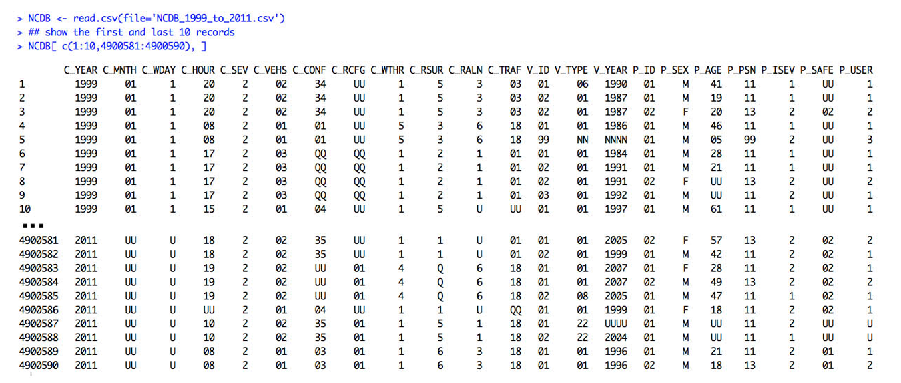
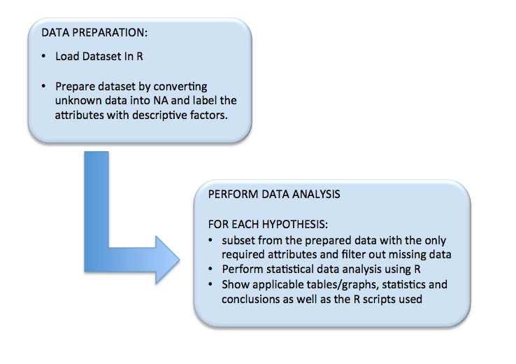

#Transport Accident Analysis
#####**Exploring Insights from National Collision Database (NCDB) Open Data from Transport Canada**
===========

### Introduction
The Government of Canada's [**Open Data Portal**](http://open.canada.ca/en) has provided an open dataset containing 13-year records of all police-reported motor vehicle collisions on public roads in Canada from 1999 to 2011. The data are provided by the provinces and territories to federal government and combined as national-level collision database. 

This project conducts statistical data analysis of the collision datasets using R application and aims to find conclusion to the folloiwng defined hypotheses:

1. [Which types of vehicular collisions have high trend of fatalities and injuries from 1999 to 2011?](doc/H01/Hypothesis_01.md)
2. [Which passenger seat position in the Light Duty Vehicles is the safest/most dangerous?](doc/H02/Hypothesis_02.md) | [Source Code](doc/H02/H02_scripts.R)
3. [Do drivers with different genders have different accident pattern?](doc/H03/Hypothesis_03.md)
4. [Is there a certain age range of drivers that are more likely to be involved in a single vehicular accident?](doc/H04/Hypothesis_04.md)
5. [In terms of single vehicular accidents, are young male drivers more dangerous compared to female?](doc/H05/Hypothesis_05.md)
6. [Which types of accidents are more frequent in various road surface conditions (e.g. dry, wet, snowy and icy)?](doc/H06/Hypothesis_06.md)
7. [Which types of accidents are more frequent in various road alignments (e.g. Straight, curved, hill, and gradient)?](doc/H07/Hypothesis_07.md)
8. [What roadway configurations (e.g. intersection, ramp etc.) and weather (e.g. raining, snowing etc.) have high frequency of collision?](doc/H08/Hypothesis_08.md)
9. [Which month of the year usually have high collision rate?](doc/H09/Hypothesis_09.md)
10. [Which particular day and time of the week have high collision rate?](doc/H10/Hypothesis_10.md)

## Dataset
The source dataset `NCDB_1999_to_2011.csv` was downloaded as of May 2015 from [National Collision Database 1999 to 2011 (NCDB)](http://open.canada.ca/data/en/dataset/1eb9eba7-71d1-4b30-9fb1-30cbdab7e63a). It has *4.9 million observations* with *22 attributes*  [309 MB size]. 

Each record has collission level, vehicle level and person level data elements as tabulated below.

#####Collision level data elements
No.| ATTRIBUTE  | SIZE  | DESCRIPTION                              |
---|------------|-------|------------------------------------------|
1  | C_YEAR     |  4	| Year in which the collision occurred 	   |
2  | C_MNTH     |  2	| Month in which the collision occurred    |
3  | C_WDAY     |  1	| Day of the week the collision occurred   |
4  | C_HOUR     |  2	| Collision hour                           |
5  | C_SEV      |  1	| Collision severity                       |
6  | C_VEHS     |  2	| Number of vehicles involved in collision |
7  | C_CONF     |  2	| Collision configuration                  |
8  | C_RCFG     |  2	| Roadway configuration	                   |
9  | C_WTHR     |  1	| Weather condition	                   |
10 | C_RSUR     |  1	| Road surface                             |
11 | C_RALN     |  1	| Road alignment	                   |
12 | C_TRAF     |  2	| Traffic control                          |

#####Vehicle level data elements
No.| ATTRIBUTE  | SIZE  | DESCRIPTION                              |
---|------------|-------|------------------------------------------|
13  | V_ID      |  2   | Vehicle sequence number                   |
14  | V_TYPE    |  2   | Vehicle type                              |
15  | V_YEAR    |  4   | Vehicle model year                        |

#####Person level data elements
No.| ATTRIBUTE  | SIZE  | DESCRIPTION                              |
---|------------|-------|------------------------------------------|
16 | P_ID       |  2    | Person sequence number                   |
17 | P_SEX      |  1    | Person sex                               |
18 | P_AGE      |  2    | Person age	                           |
19 | P_PSN      |  2    | Person position	                   |
20 | P_ISEV     |  1    | Injury Severity (Medical treatment required)             |
21 | P_SAFE     |  2    | Safety device used	                   |
22 | P_USER     |  1    | Road user class	                   |

  
#####[DATA DICTIONARY](doc/Data_Dictionary.md)
For more detailed information, refer to the [**DATA DICTIONARY**](doc/Data_Dictionary.md) for all possible values and their meaning for each attribute.

## Approach

 
#####Data Preparation
Dataset is loaded into dataframe named "NCDB" and replaced the unknown and not available attributes into NA values.
Factors of the attributes are changed into descriptive labels according to the [data dictionary](Data_Dictionary.md).
Filter the datasets into "complete cases only" to remove not applicable values.
Capture the screenshots of the tables and Generate the graph.

 
## Results

No. | Hypothesis | Result | Source Code 
----|-----------|--------|------------|
1. | Which types of vehicular collisions have high trend of fatalities and injuries from 1999 to 2011? | [Results](doc/H01/Hypothesis_01.md) | [Source Code](doc/H01/H01_scripts.R)
2. | Which passenger seat position in the Light Duty Vehicles is the safest/most dangerous?| [Results](doc/H02/Hypothesis_02.md) | [Source Code](doc/H02/H02_scripts.R)
3. | Do drivers with different genders have different accident pattern?| [Results](doc/H03/Hypothesis_03.md) | [Source Code](doc/H03/H03_scripts.R)
4. | Is there a certain age range of drivers that are more likely to be involved in a single vehicular accident? | [Results](doc/H04/Hypothesis_04.md) | [Source Code](doc/H04/H04_scripts.R)
5. | In terms of single vehicular accidents, are young male drivers more dangerous compared to female? | [Results](doc/H05/Hypothesis_05.md) | [Source Code](doc/H05/H05_scripts.R)
6. | Which types of accidents are more frequent in various road surface conditions (e.g. dry, wet, snowy and icy) ? | [Results](doc/H06/Hypothesis_06.md) | [Source Code](doc/H06/H06_scripts.R)
7. | Which types of accidents are more frequent in various road alignments (e.g. Straight, curved, hill, and gradient)? | [Results](doc/H07/Hypothesis_07.md) | [Source Code](doc/H07/H07_scripts.R)
8. | What roadway configurations (e.g. intersection, ramp etc.) and weather (e.g. raining, snowing etc.) have high frequency of collision?| [Results](doc/H08/Hypothesis_08.md) | [Source Code](doc/H08/H08_scripts.R)
9. | Which month of the year usually have high collision rate? | [Results](doc/H09/Hypothesis_09.md) | [Source Code](doc/H09/H09_scripts.R)
10. | Which particular day and time of the week have high collision rate? | [Results](doc/H10/Hypothesis_10.md) | [Source Code](doc/H10/H10_scripts.R)

