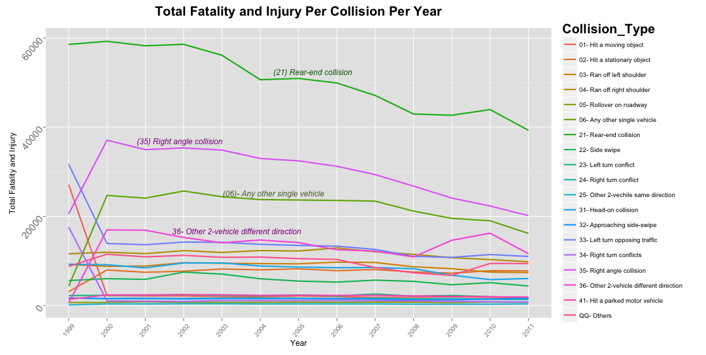

##### Hypothesis 01:
### Which types of vehicular collisions have high trend of fatalities and injuries from 1999 to 2011?
--

The dataset is filtered out to tabulate only those collisions that resulted to "Injury" or "fatality" and plot the trends per collision types from year 1999 to 2011. The result shows that the majority of the collission accidents have decreased significantly from 2000 to 2011. The collision (type 21) "**Rear-end Collission**" (two vehicles running on the same direction) is prominently the highest collision type that has the highest frequency of combined injury and fatality followed by "**Right angle collision**" (two vehicles running on different direction). Both collision types have decreased significantly for about 20,000 incidents for the eleven years since year 2000. Majority of the rest of the collision types have consistent declining trends as well. Interestingly, there is a spike increase and decrease of collission type (36) "**Other 2-vehicles different direction**" between the year 2008 and 2011.



The following is the tabulated summary of **total injury and fatality** for each collision type per year. The figures do not include the collision incidents that have no injury:


#####Hypothesis Testing:

Wilocoxon test is performed to validate if the mean of  *Read End Collision* is higher than the othe next two and the result has a high significant value of **p=0.0001221** indicating that it is truly greater than the rest of the collision types.
`wilcox.test(result$Rear_End_Collision, result$Right_Angle_Collision, paired=TRUE, alternative="greater")`
```

  Wilcoxon signed rank test
  
  data:  result$Rear_End_Collision and result$Right_Angle_Collision
  V = 91, p-value = 0.0001221
  alternative hypothesis: true location shift is greater than 0
```

`wilcox.test(result$Rear_End_Collision, result$Other_Single_Vehicle, paired=TRUE, alternative="greater")`
```
  	Wilcoxon signed rank test

  data:  result$Rear_End_Collision and result$Other_Single_Vehicle
  V = 91, p-value = 0.0001221
  alternative hypothesis: true location shift is greater than 0
  
```


--
 
[Home](../../README.md)  | [R Scripts used in this analysis](H01_scripts.R)
------------------------ | ---------------------------
 |
 


