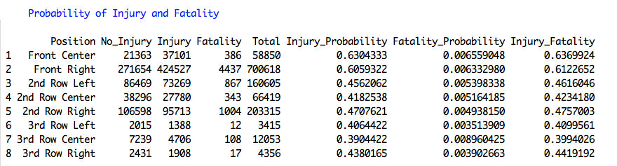
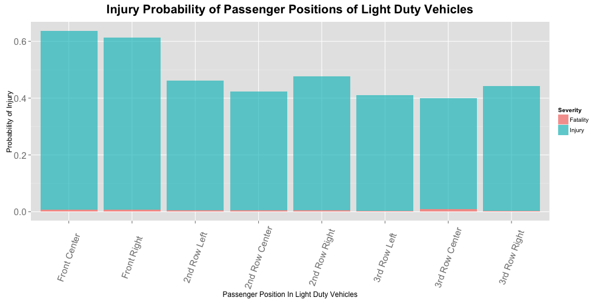

#### Hypothesis 02:
### Which passenger seat position in the Light Duty Vehicles is the safest/most dangerous?
--

The dataset is subset to extract only the accident records of the vehicles classified as **Light Duty Vehicles** (such as car, van, light utility vehicles or truchs) and further filtered out to extract only passenger records. The records are then tabulated according to the seat position of the passenger and according to the severity (No injury, with Injury or Fatality). 

The resulting graph shows that, in general, the **front row** seats appear to have the highest Injury rate among all the passenger seat positions (with *Front Center* having 64% followed by *Front Right* with 61% Injury probability),

For a two-row  light-duty vehicle, the **2nd Row Center** appears to be the safest passenger position having 42% injury.

The **3rd Row Center** appears very interesting as it appears to be having the lowest injury probablity among all the positions but at the same time it has the highest fatality ratio compared to other positions.

|Table and Graphs|
|-------|
||
||

--
 
[Home](../../README.md)  | [R Scripts used in this analysis](H02_scripts.R)
------------------------ | ---------------------------
 |
 

