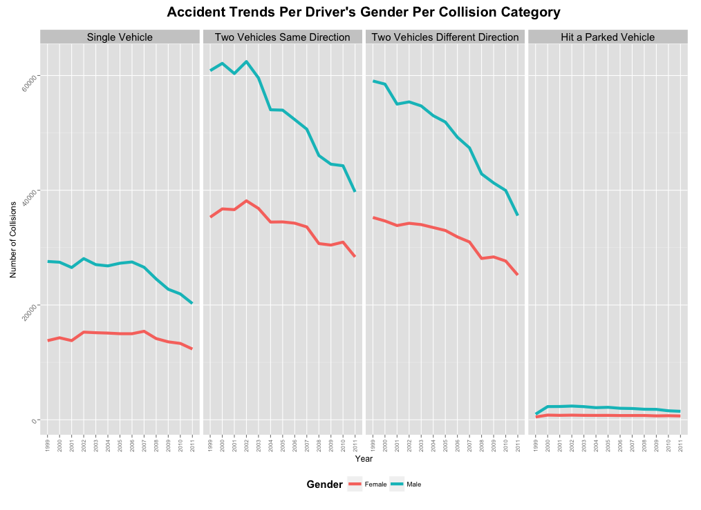

#### Hypothesis 03:
### Do drivers with different genders have different accident pattern?
--

The dataset is filtered out to extract only the accident records of the drivers. 

To simplify the analysis of trend, the collision types are converted into four major categories 
* Single Vehicle In Motion
* Two Vehicles In Motion - Same Direction of Travel
* Two Vehicles In Motion - Different Direction of Travel
* Hit a Parked Motor Vehicle

The data is tabulated according to **Gender** and **Collision Category** per year. The data is visualized to show the yearly trend of male female drivers for each major collision categtory. The graph below shows in four panel per collision type and for each collisison type shows the yearly trend from 1999 to 2011. The frequency of the accidents occured for male drivers are consistently higher than female drivers. Although there is a big difference in frequency, the accident trends of male drivers for each collision category are very similar compared to the female drivers and it apperas that ** there is no significan difference between two genders.* 

--
        
        [Home](../../README.md)  | [R Scripts used in this analysis](H03_scripts.R)
------------------------ | ---------------------------
        |
