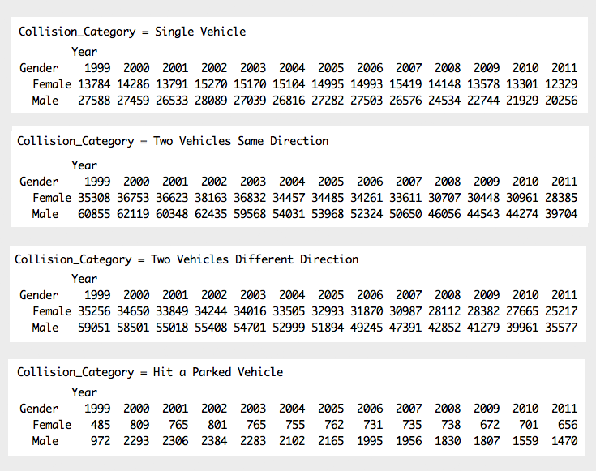

#### Hypothesis 03:
### Do drivers with different genders have different accident pattern?
--

To simplify the analysis of trend, the collision types are converted into four major categories 
* Single Vehicle In Motion
* Two Vehicles In Motion - Same Direction of Travel
* Two Vehicles In Motion - Different Direction of Travel
* Hit a Parked Motor Vehicle

The rest of collision types are excluded and only the records of drivers are summarized. Below is the summary of **number of collisions** per gender of the driver for each major collision category per year:

Graph:
Although the frequency of the accidents occured for male drivers are always higher than female drivers, the graph clearly shows that **there is no significant difference in accident trends** between the two genders between 1999 and 2011. This is the same for all four major collision categories. 

--
        
        [Home](../../README.md)  | [R Scripts used in this analysis](H03_scripts.R)
------------------------ | ---------------------------
        |
