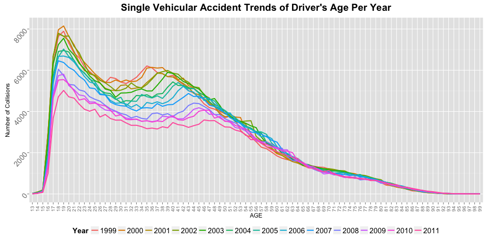
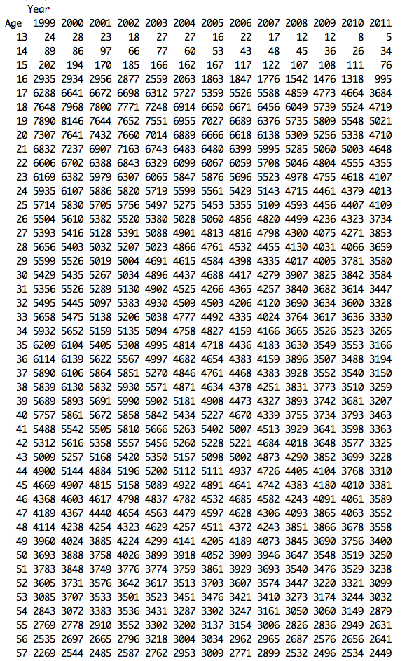
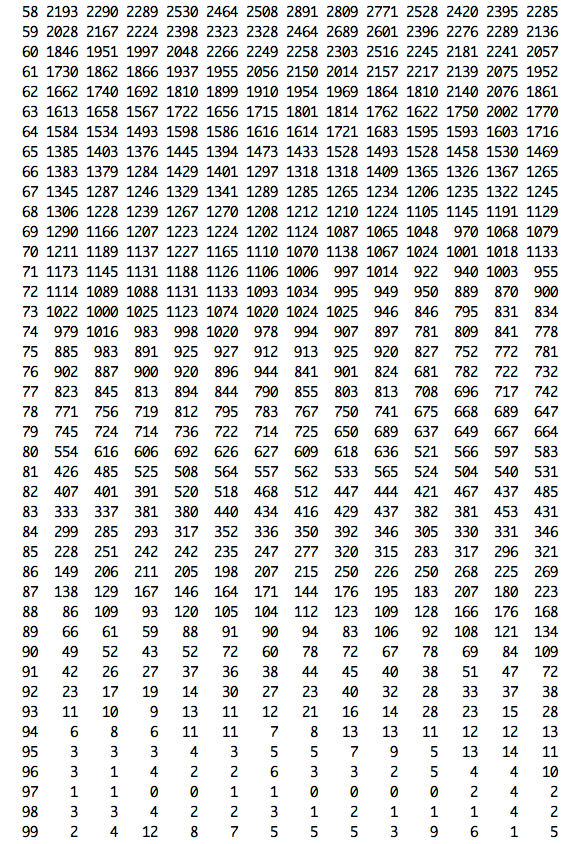

#### 04:
### Is there a certain age range of drivers that are more likely to be involved in a single vehicular accident?
--

This hypothesis focuses only in single vehicular accident of driver's records in the assumption that this subset will mostly capture the driver's fault. Vehicle collision records are extracted to include only those accidents categorized as *single vehicular collision* and only the records of the drivers. The records are then tabulated per age and per year. 

The resulting graph shows the decline in frequency of accidents from 1999 to 2011 but it is very consistent over the years that the young drivers with age group approximately around 16 to 21 have the highest rate of accident. 

Interestingly, there is also a consistent gradual spike in age group 35 to 40 from 1999 and the spike is gradually decreasing in frequency but gradually sliding forward by age over the years.

Below are the tabulated accidents as illustrated in the graph:

 

--
        
        [Home](../../README.md)  | [R Scripts used in this analysis](H04_scripts.R)
------------------------ | ---------------------------
        |
