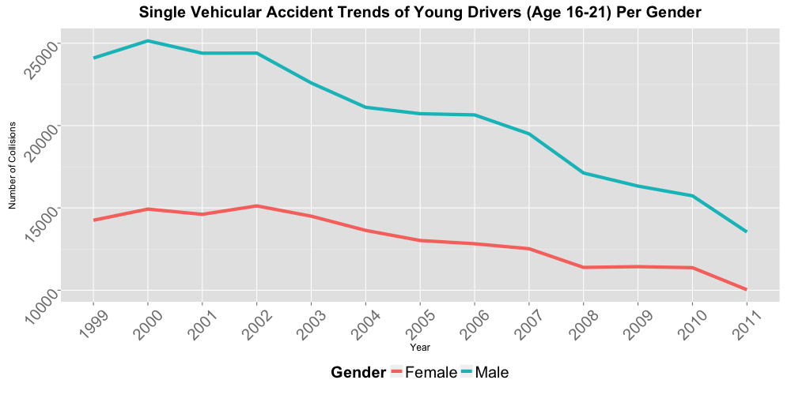

#### Hypothesis 05:
### In terms of single vehicular accidents, are young male drivers more dangerous compared to female drivers?
--

As concluded in hypothesis 04 that young drivers between 16 and 21 being the age group with the highest frequency of single vehicular accidents, this hypothesis tries to determine if the male drivers have different accident trend compared to female drivers.  The resulting graph shows that the frequency of young male driver accidents is consistently higher than female drivers but it has significantly reduced over the years. Although the trend has consistently declined, **the accident trends of both genders are very similar and have no significant difference.**

Below are the tabulated single vehicular accidents of young drivers 16 to 21 years old from 1999 to 2011.

--
        
        [Home](../../README.md)  | [R Scripts used in this analysis](H05_scripts.R)
------------------------ | ---------------------------
        |
