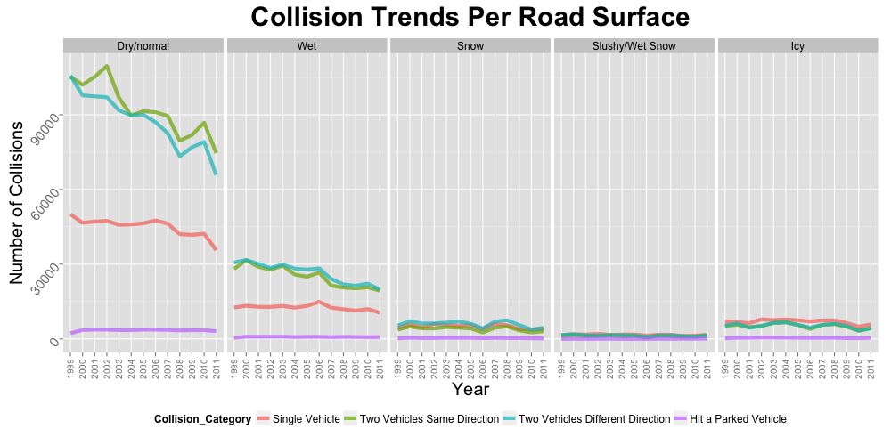
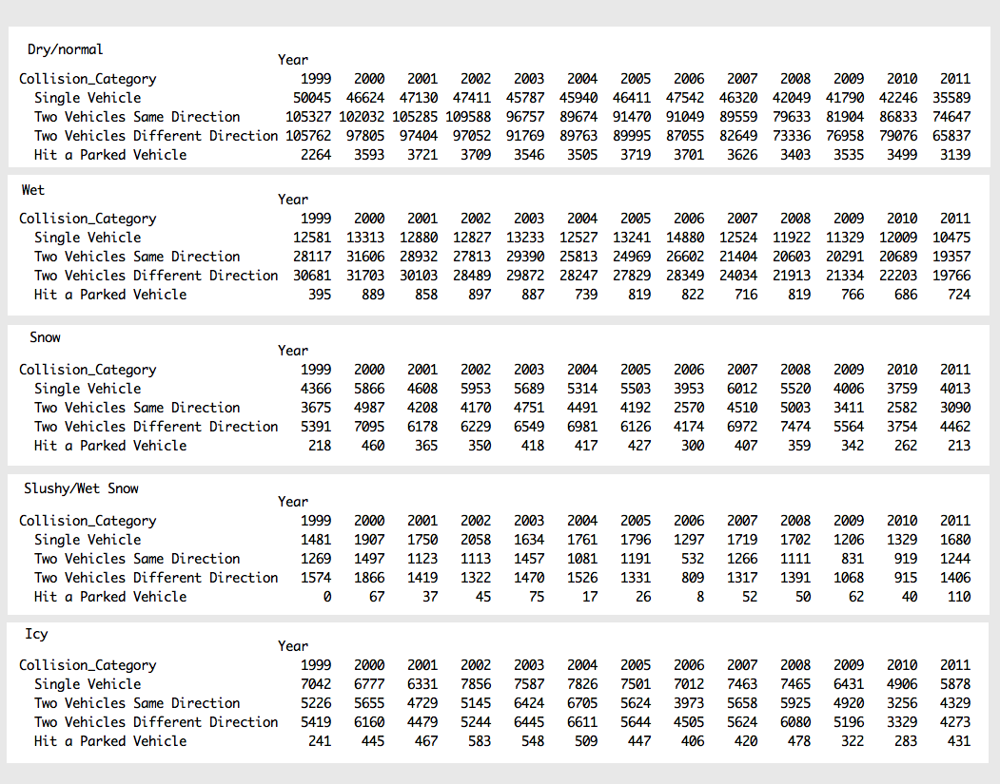

#### 06:
### Which types of accidents are more frequent in various road surface conditions?

--

This hypothesis tries to determine which kind of accidents frequently happen in certain type of road surface conditions. To simplify the visualization, the collision types are categorized into four major categories:
 - Single vehicular collisisons, 
 - Two vehicles in the same dierction
 - Two vehichels in different direction and
 - Hitting a parked vehicles.
 
Road surface conditions are reduced as well into the following:
 - Dry/Normal
 - Wet
 - Snow
 - Slushy (wet snow) and
 - Icy

The rest of the road surface conditions are also removed (such as gravel/sand, oil, muddy and flooded) as the proportion of these surface are very small.

Below is the resulting graph with five panels for each identified road surface. Surprisingly, the *"Dry/Normal"* road surface condition prominently has the highest number of collision compared to the rest. The *two vehicular accidents*  (both same and different direction) are the most type of collisions that happen in dry/normal conditions. 

For the wintry (snow, slushy/wet snow and icy) road surface conditions, all types of collisions have not much difference in frequency but surprisingly very low compared to the "dry/normal" road surface.

--
        
        [Home](../../README.md)  | [R Scripts used in this analysis](H06_scripts.R)
------------------------ | ---------------------------
        |
