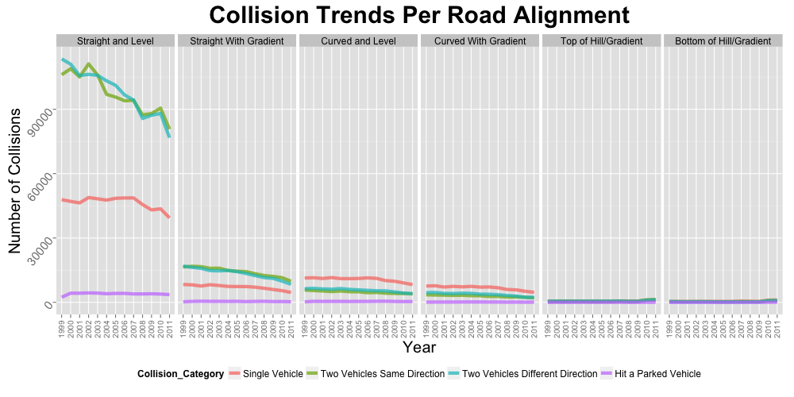

#### 07:
### Which types of accidents are more frequent in various road alignments?

This hypothesis tries to determine if there is a different collission trends between different road alignments.

Similar to previous hypothesis, the collision types are categorized into major categories and will plot its trends based on the following road alignments:
 - Straight and level
 - Straight with gradient
 - Curved and level
 - Curved with gradient
 - Top of hill or gradient
 -  Bottom of hill or gradient 

The resulted graph below shows that the **curved** roads (3rd and 4th panel) have the slightly higher rate of "**single vehicular collision**" compared to other collision types. Out of all types of road alignments, the normal **Straight and Level** road alignment prominently has very high frequency of collissions led by "two vehicular collisions".

--

--
        
        [Home](../../README.md)  | [R Scripts used in this analysis](H07_scripts.R)
------------------------ | ---------------------------
        |
