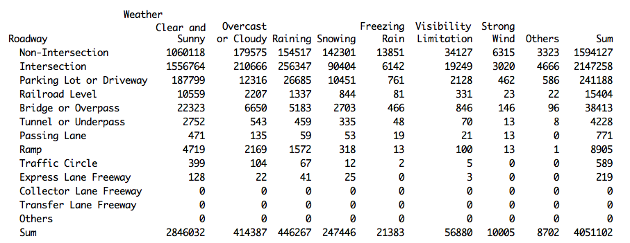

#### Hypothesis 08:
### What roadway configurations (e.g. intersection, ramp etc.) and weather (e.g. raining, snowing etc.) have high frequency of collision?
--

This hypothesis visualizes the frequency of collisions from different roadway configurations (such as intersection, ramp, express lane etc.) under different weather (raining, snowing, freezing rain etc.). The figures below show the tabulation of all vehicular accident reports from 1999 to 2011 with known roadway configuration and reported weather condition at the time of collision.  The graph shows a very outstanding number of collisions happen in **intersection** of public roadways followed by non-intersection (such as mid-block) roads. For both roadway configuration, about 2/3 of the collisions happened on good "**clear and sunny** weather condition.

--
        
        [Home](../../README.md)  | [R Scripts used in this analysis](H08_scripts.R)
------------------------ | ---------------------------
        |
