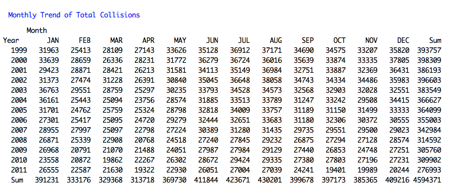

#### 09:
### Which month of the year usually have high collision rate?
--
For total collisions, there are two periods in a year that has the highest rates of collissions. Summer months (**July and August**) and winter months (**December and January**). The trend is consistent over the years despite the drastic decline of total collisions from 1999 to 2011.

The second set of graph and table is a tabulation of dataset extracting only those collisions that produced fatality. The graph illustrates similarly that summer months of the year (**July and August**) appear the highest number of fatalities due to vehicular accidents.

--

|**TOTAL COLLISIONS**|
|:------------------:|
|
|

--

|*FATALITIES*|
|:------------------:|
|
|

--
        
        [Home](../../README.md)  | [R Scripts used in this analysis](H09_scripts.R)
------------------------ | ---------------------------
        |
