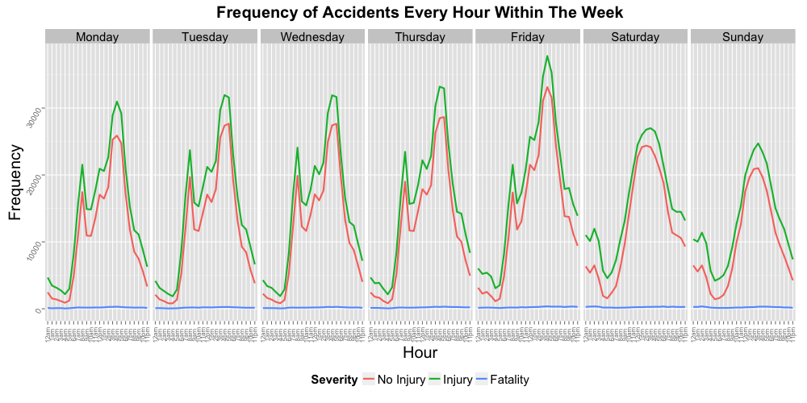
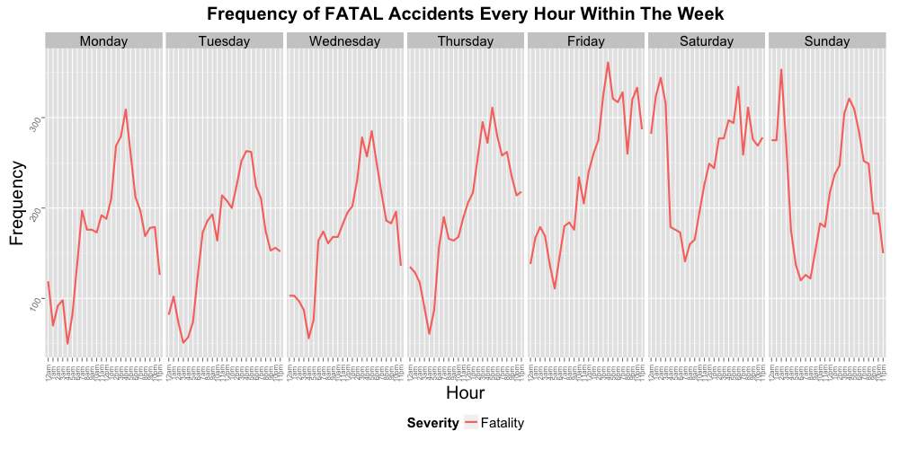
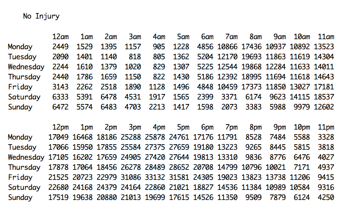
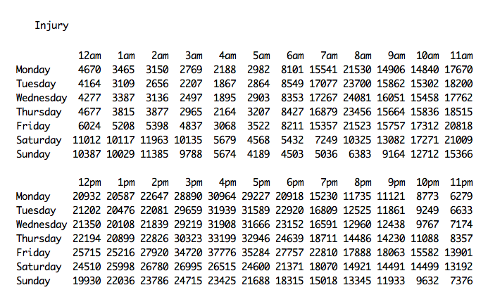
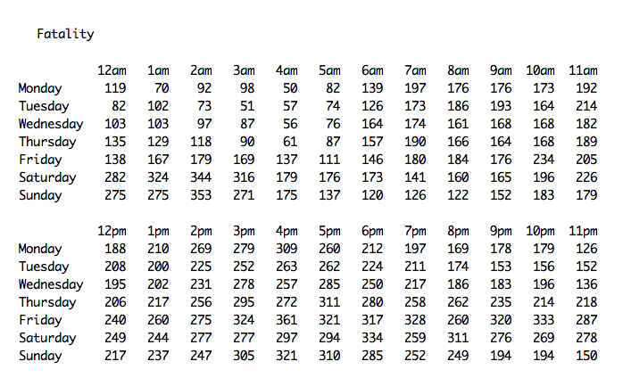

#### 10:
### Which particular day and time of the week have high collision rate?

--

The graphs and tables below visualizes the trend of the collisions every hour within the whole week. The number of collisions are aggregted from all collisions from 1999 to 2011. The graph segregates the collision into three levels of severity ("No Injury", "Injury" and "Fatality")

The graph shows a consistent spike of collision rate every weekday at around 4PM to 5PM and even higher on Friday. On weekends, the spike of collision rate changes to late afternoon. 

The first graph shows the series of the "fatal" collisions appear to be flat-lined as the frequency of it is too small compared to other "non-fatal" collisions. This series of "fatal" collisions is plotted separately on the second graph. The fatal collision rates show similar time on weekdays but it changes wider at weekend nights (Friday and Saturday) evening until few hours more passed the next day.

---

|Tabulated Frequency of Collisions 1999-2011|
|---|
||
||
||

--
        
        [Home](../../README.md)  | [R Scripts used in this analysis](H10_scripts.R)
------------------------ | ---------------------------
        |
